# WebApp simple menggunakan Codeigniter 4

buat WebApp simple pake framework Codeigniter 4 (4.7.2)

## Langkah-langkah 


1. **Persiapan**
    - Editornya, misal Visual Studio Code.
    
    
    - XAMPP, kalo belum punya unduh dulu di [sini](https://www.apachefriends.org/).

    - Buka XAMPP control panel dulu, aktifin ``apache`` dan ```mysql``` lalu ke ```php.ini```
    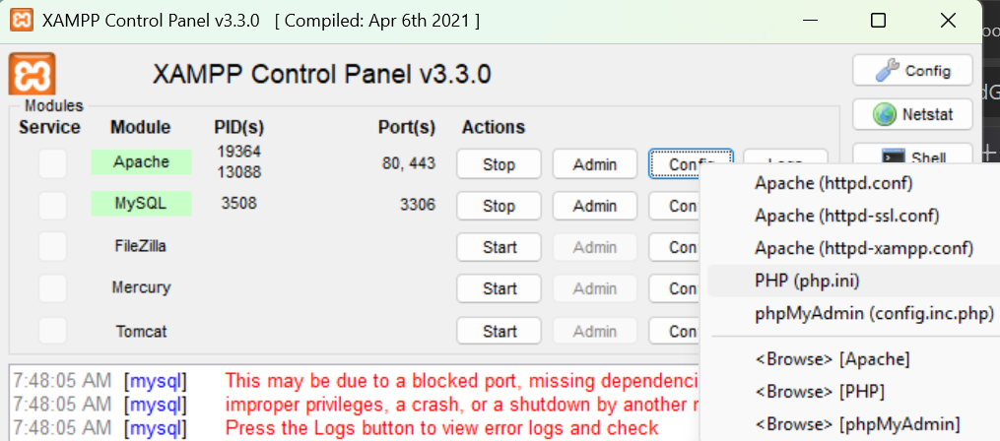 
    
    buat aktifin 
    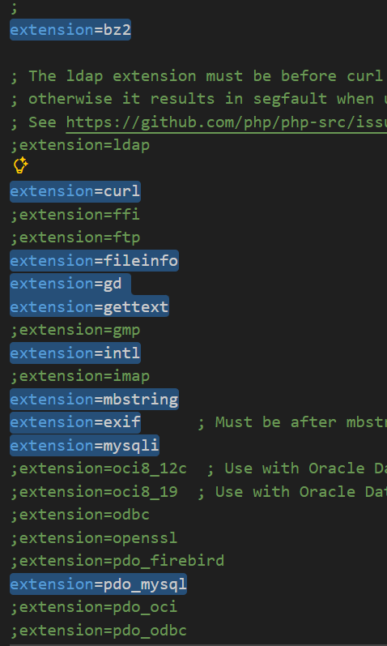

    - Clone [Lab7Web_CI4](https://github.com/laLafid/Lab7Web_CI4)


2. **Part 8 : AJAX (Asynchronous JavaScript and XML)**
    - AJAX untuk load daftar artikel juga gunakan banyak dom

    - Buat dulu controllernya [Ajax.php](app/Controllers/Ajax.php), ini menggunaka JQuery.

    - Lalu buat view untuk Ajax di [index.php](app/Views/ajax/index.php)

    - tampaknya :
    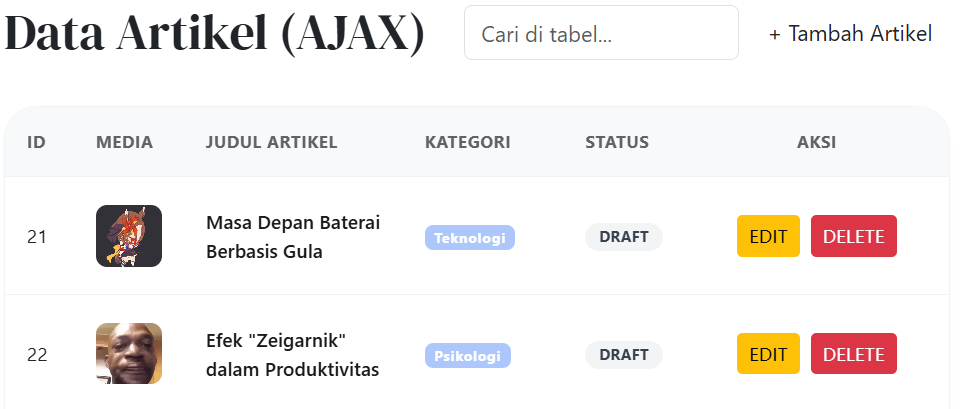

3. **Part 9 : Implementasi AJAX Pagination dan Search**
    - Modifikasi Admin_index 
    ```php
    if ($this->request->isAJAX()) {
            return $this->response->setJSON($data);
        } else {
            $kategoriModel = new KategoriModel();
            $data['kategori'] = $kategoriModel->findAll();
            return view('artikel/admin_index', $data);
        }
    ```

    - Modifikasi View (admin_index.php)
    * Ubah view `admin_index.php` untuk menggunakan jQuery.
    * Hapus kode yang menampilkan tabel artikel dan pagination secara langsung.
    * Tambahkan elemen untuk menampilkan data artikel dan pagination dari AJAX.
    * Tambahkan kode jQuery untuk melakukan request AJAX.


4. **Part 10 : API**
    - Pertama-tama unduh aplikasi REST Client, [Postman.](https://www.postman.com/downloads/)

    - Buat [REST Controller](app/Controllers/Post.php)

    - nah karena ini untuk keperluan API, kita mesti pakai [Routes.php](app/Config/Routes.php) meski menggunakan autoroute. tambahin ```$routes->resource('post');```

    - Buka aplikasi postman dan pilih create new(tanda plus) → HTTP Request, trus pake metode GET dan isi alamatnya macam ni ```http://localhost:8080/post/2``` atau seperti digambar(sesuaikan dengan alamat dan id artikel kalian) lalu klik send
    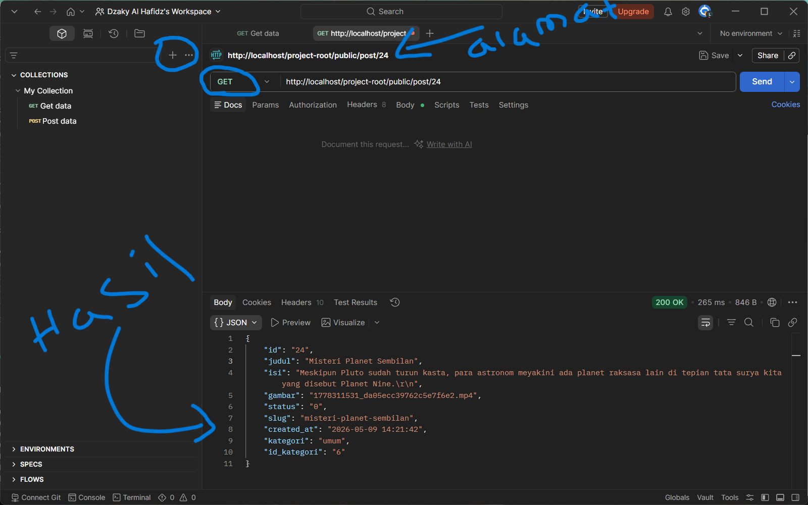

    - Untuk mengubah data, silakan ganti method menjadi PUT.
    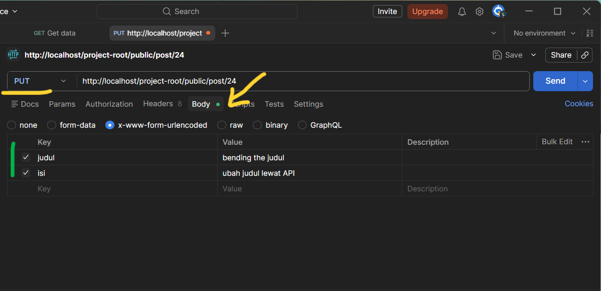
    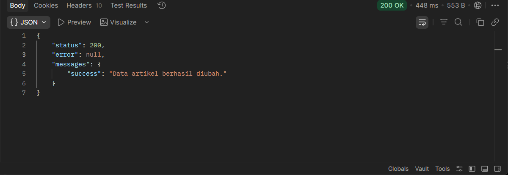

    - menggunakan method POST untuk menambahkan data baru ke database.
    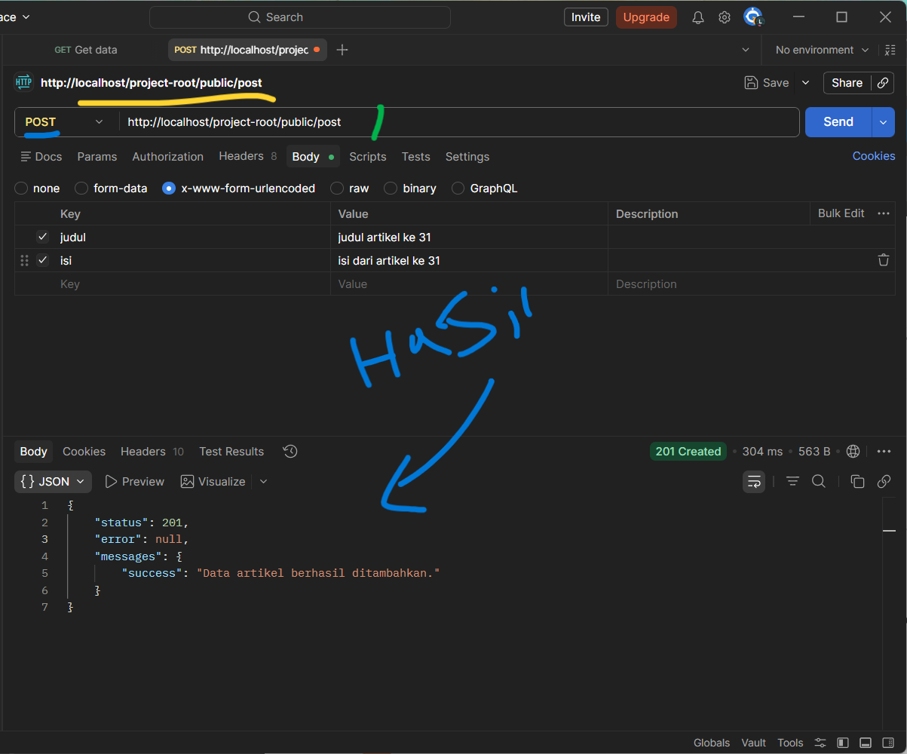

    - Pilih method DELETE untuk menghapus data.
    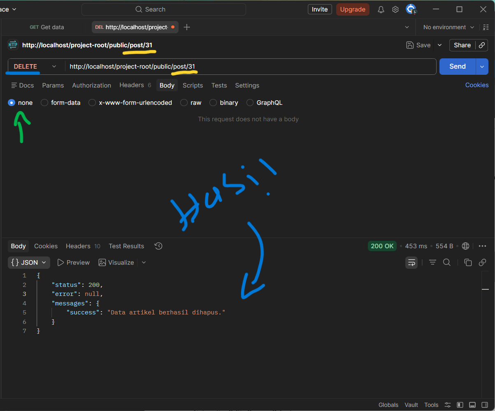


## Hasil Akhir

1. **Gambar**

    **Admin**:

    [Admin Dashboard](app/Views/artikel/admin_index.php)
    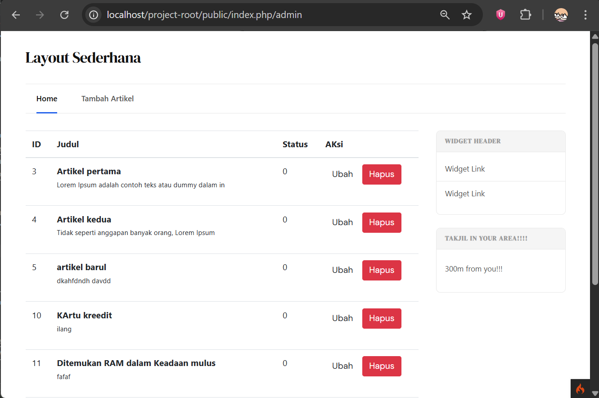

    [Edit Artikel](app/Views/artikel/form_edit.php)
    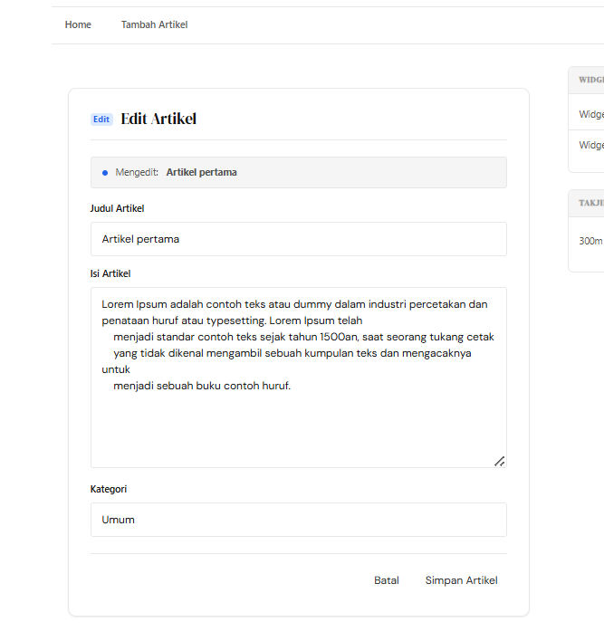

    [Add Artikel](app/Views/artikel/form_add.php)
    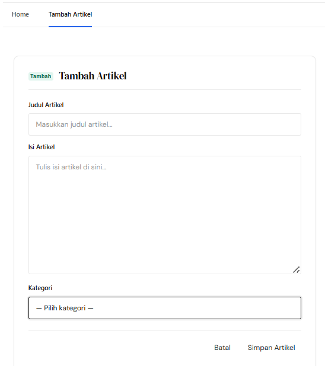

    **Login Page**:
    [Login](app/Views/user/login.php)
    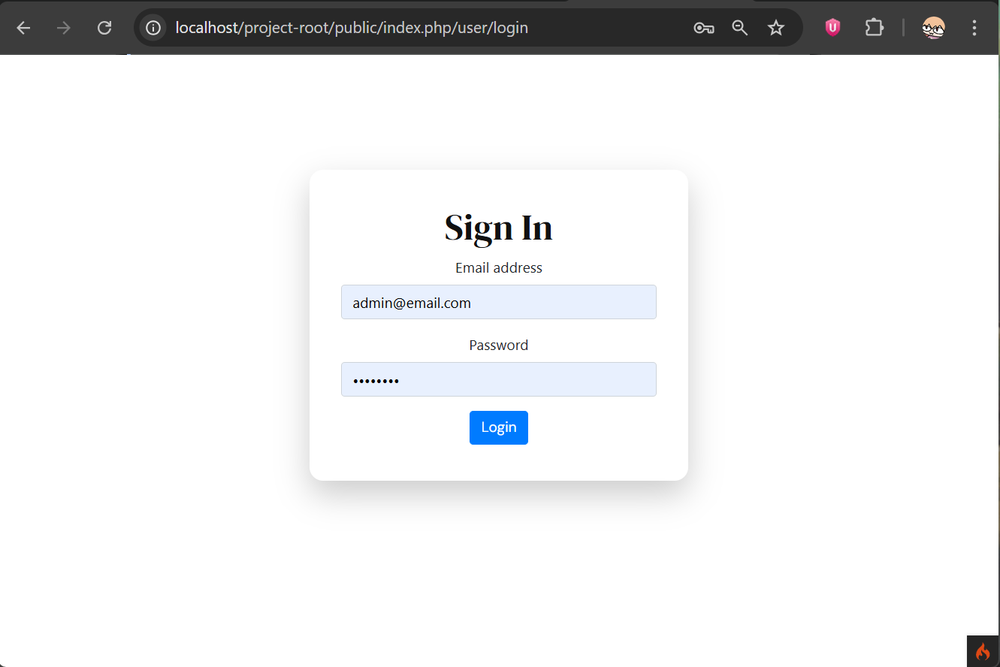

    **User**:

    [Home](app/Views/vi/home.php)
    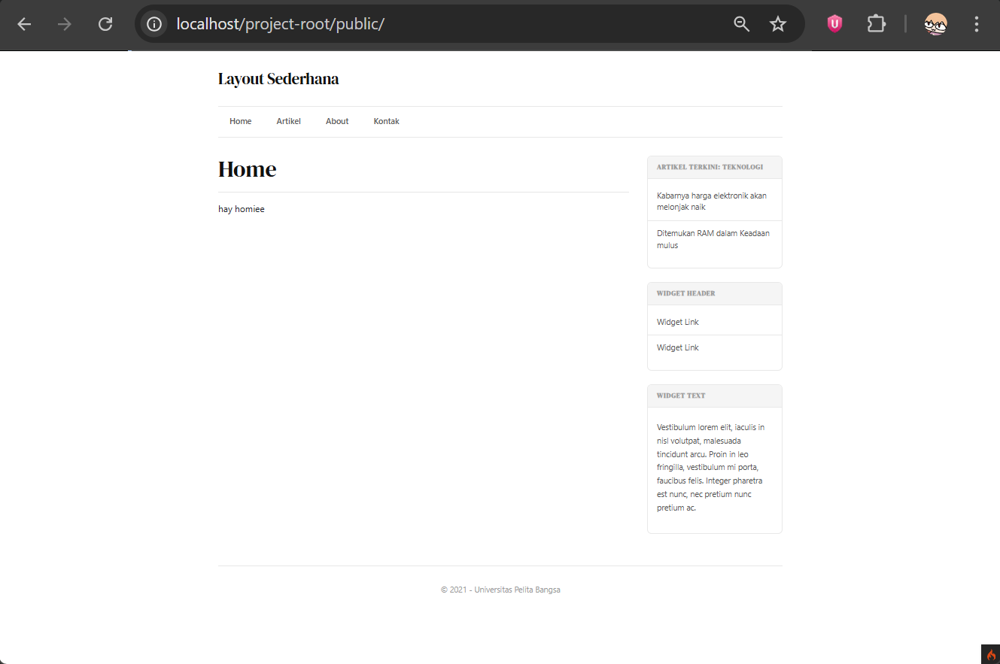

    [About](app/Views/vi/about.php)
    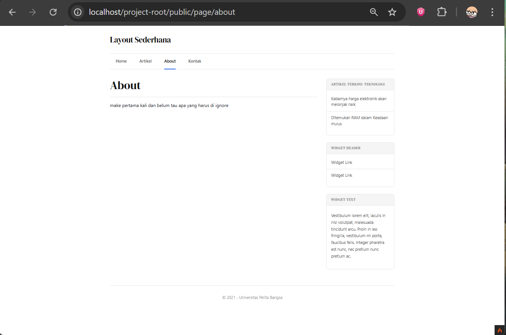

    [Artikel](app/Views/artikel/index.php)
    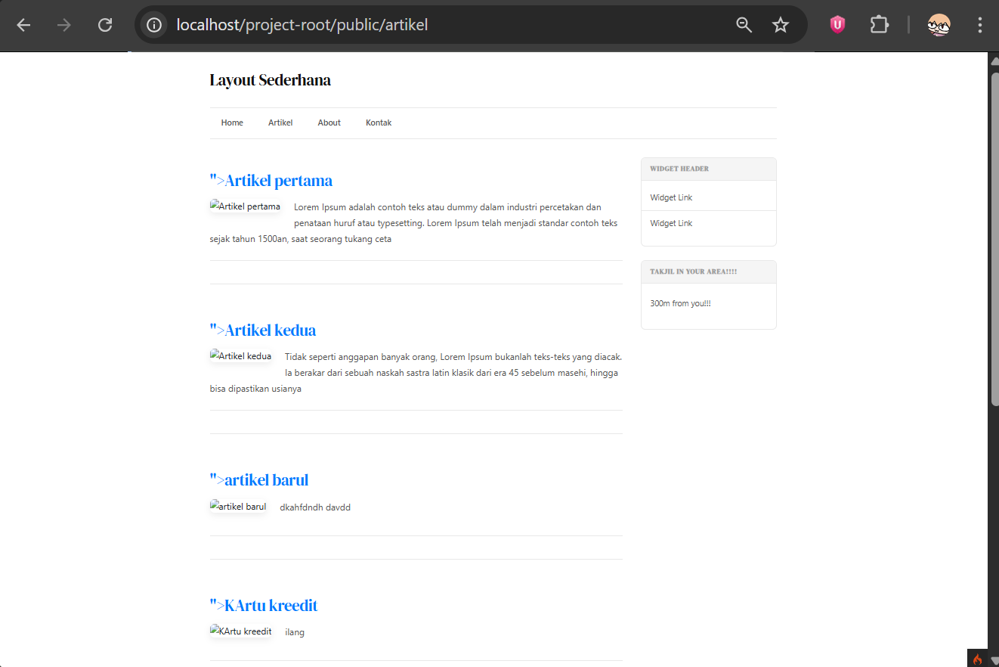
    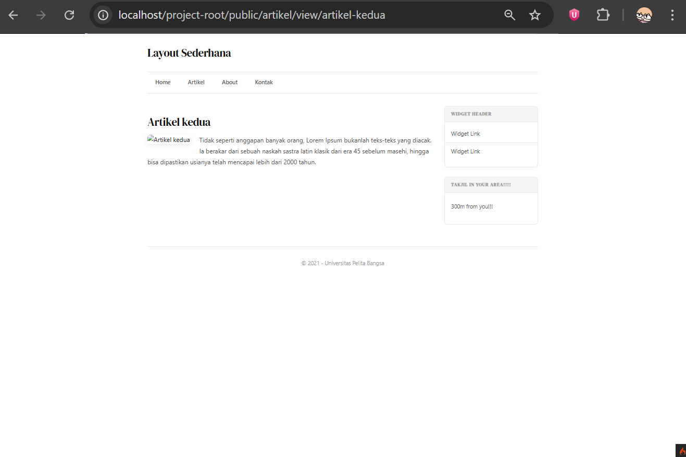

    [Kontak](app/Views/vi/contact.php)
    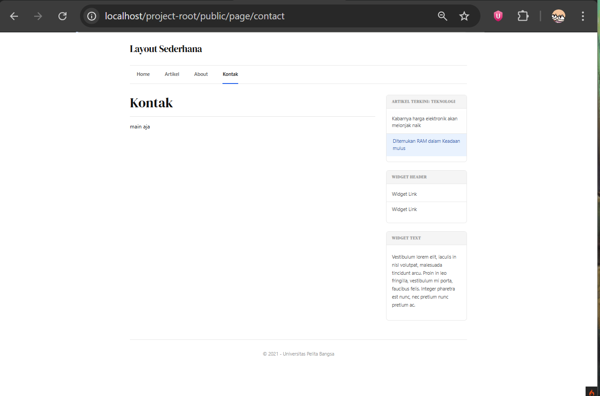
    

## Akhir Kata

*Selamat mencoba*
